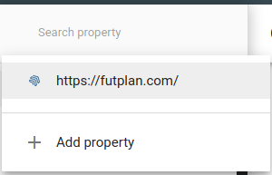

# Google Search Console

Google Search Console is a free tool offered by Google to help website owners monitor their website’s presence in Google search results.  

It helps you track search rankings along with keeping you updated about site errors, security issues, and indexing issues that may affect your website’s search performance.  

### Get started...
Visit the [Google Search Console](https://search.google.com/search-console/welcome) website and click on the ‘Start Now’ button.

### Adding your site to `Google Search Console`
1. Click on `Add property`  
  
1. Add new domain name
1. Add the `TXT` value to your `TXT` property in `DNS configuration`. Give it a long `TTL` as this is a fixed value that can be statically cached.
1. Propagation of the new DNS config accross the network can probably take a while, maybe good moment to add an event in your calendar and get back here in a couple of days.